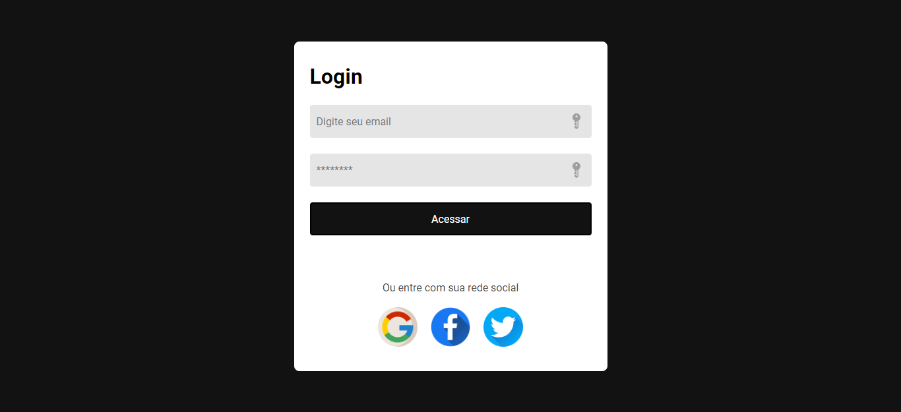

# Login Page

Desafio realizado através do [DevMentor](https://www.devmentor.com.br).
O desafio era construir esta página de login e fazê-la parecer o mais próximo possível do design, que inclui a responsividade.

Você pode visualizar o projeto [aqui](https://josephmatheus.github.io/login-page-main). 🚀

---
## Screenshot

---
## Tecnologias Utilizadas

- HTML
- CSS
- SASS
- SCSS

---
## Autor

<a href="https://www.github.com/josephmatheus">
    
    
Joseph Matheus

</a>

 

Feito com ❤ por Joseph Matheus. Deixa um feedback? 👋

---
